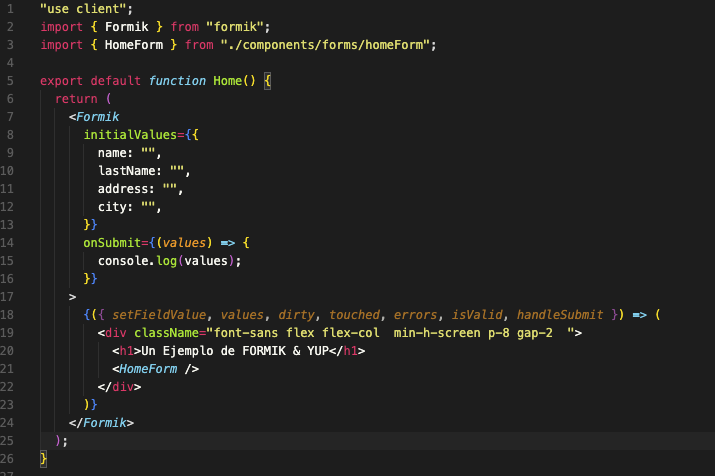
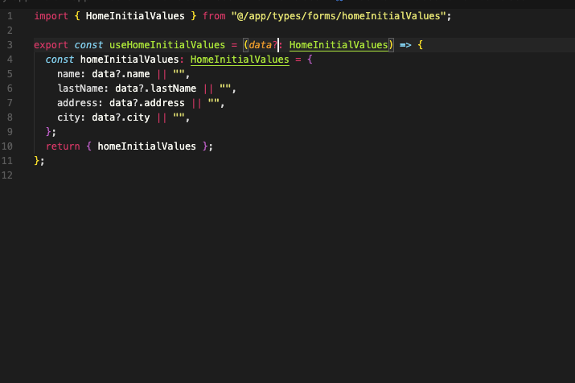
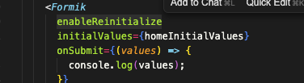
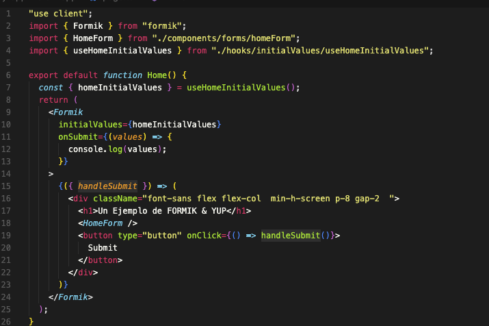
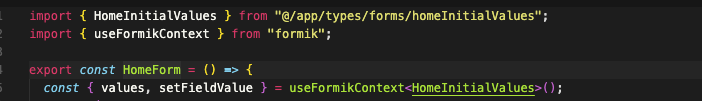

# Bienvenidos a la explicación de Formik 🚀


Formik es una librería de control de formularios HTML muy popular al día de hoy, con **5.8 millones de descargas**.

Es muy sencillo su uso cuando conocemos las 4 o 5 cosas que se utilizan en el día a día, y lo veremos a continuación.

## 1. Envolviendo tu aplicación con Formik

Lo primero será envolver nuestro formulario con el componente **Formik**.  
Normalmente con eso bastaría, pero yo prefiero hacerlo en una medida más grande, porque normalmente vamos a necesitar data de ese formulario fuera del mismo —ya sea para disparar acciones o condiciones según el caso—, por eso prefiero envolver toda una ruta o página completa.



## 2. Initial Values

Dentro de este se definen varias cosas, así que comencemos con la más importante:

```jsx
initialValues={{name: "example"}}
```

Los **initialValues** son los valores iniciales de nuestro formulario. Si es muy pequeño, lo normal es que lo dejemos como el ejemplo anterior, pero también para determinar si dejarlos o no aquí hay que saber si esta data va a cambiar.

Si es un formulario que recibe datos por ejemplo mediante un ID, y este nos puede traer o no datos del formulario, es mejor llevar estos **initialValues** fuera para poderlos modificar más fácilmente y de manera modularizada.



### enableReinitialize

> **NOTA:** Es importante que para que el formulario pueda cambiar sus valores iniciales debemos pasar la prop `enableReinitialize`



## 3. HandleSubmit

Por otro lado, para disparar el submit del formulario me gusta hacerlo a través de una función que nos ofrece el mismo Formik: **handleSubmit**.

Normalmente la utilizo dentro del típico button submit del formulario, pero también podemos disparar esta función desde donde queramos. Esto nos da mucho control para esta acción, por ejemplo:

- Dispararlo automáticamente cuando todos los campos estén completos
- Disparar el submit desde buttons que no están dentro del `<form>`, siempre y cuando esté envuelto en el Formik



## 4. useFormikContext

Para usar todas las características del Formik, el componente debe estar envuelto dentro de un componente Formik, y eso nos lleva a otro punto importante: **useFormikContext**.



Este hook va a consumir el `handleSubmit` o los `values` del Formik padre.

## 5. setFieldValue

Por otro lado, podemos trabajar el formulario con los `onChange` de toda la vida, pero tiene una función que me gusta más: **setFieldValue**.

Con esta función podemos definir exactamente qué campo vamos a apuntar, rellenar o modificar. Esta función recibe:

- El **name** (debe apuntar a uno de los nombres de los valores initialValue)
- El **valor** (que normalmente proviene del `e.target.value`)

Pero de hecho podemos llenar varios campos a la vez, ejemplo:


Podemos hacer que buttons actualicen el valor, tipo:


Entonces `setFieldValue` nos da mucha flexibilidad y control sobre el formulario.

## 6. Otras propiedades útiles de Formik

Creo que con esta información ya podemos hacer formularios de bastante calidad, modularizables y escalables. Formik tiene muchas más propiedades como:

### dirty

Nos dice si el usuario ha modificado al menos alguno de los valores iniciales _(Boolean)_

### setFieldTouched

Ejemplo: `onBlur={() => setFieldTouched("email", true)}`  
Funciona para setear qué campo ha tocado _(hizo focus y salió)_

### errors

Nos muestra qué campo no ha pasado la validación que no he explicado en este repo, pero que suele hacerse con Yup.

### touched

Ejemplo:

```jsx
<Field name="password" type="password" />;
{
  touched.password && errors.password && <div style={{ color: "red" }}>{errors.password}</div>;
}
```

Nos muestra qué campos ya han sido tocados o no.

## 7. Reflexión final sobre formularios dinámicos

Por último, y esto ya fuera de Formik: he aprendido que **mientras más fácil y sencillo, mejor**.

Ponerse a mapear campos de un formulario a partir de un array de objetos solo lo veo viable cuando se repiten formularios prácticamente iguales y estás seguro de que van a hacer prácticamente lo mismo: recoger y enviar datos, nada más.

Pero para mí es mejor hacer algo tipo el componente `<HomeForm>` de este repositorio, porque normalmente terminan agregando o quitando cosas. Que si un input lleva icono y otro no, que si el campo `name` de aquí debe llevar mínimo 5 letras, en el otro lado 8 y en el otro 4... entonces empezamos a agregar condiciones: "si paso este u otro flag, haz esto u lo otro", y se vuelve un infierno.

Espero que mi poca/mucha experiencia (según para quien lea este repositorio) sea de ayuda, y por supuesto estoy dispuesto a escuchar mejoras.

He realizado muchísimos formularios siguiendo estos lineamientos y la verdad se vuelve sencillo y repetitivo una vez que los dominas.
